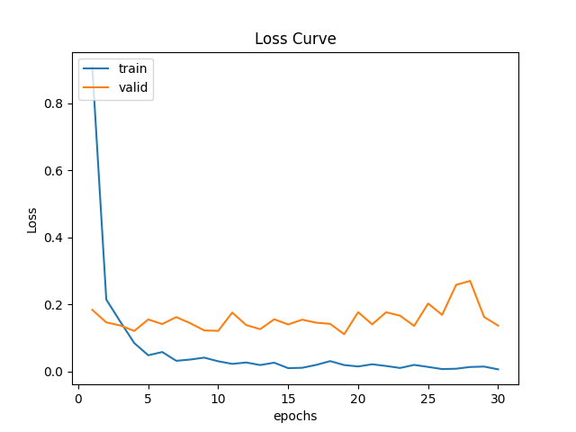
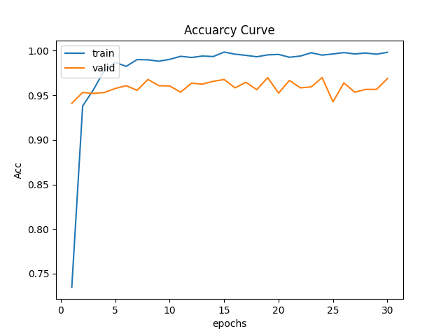

# ML_Homework_1

Author: 612410065/洪祐鈞

The template is forked from [ricky-696's
ML_Assignment_Example ](https://github.com/ricky-696/ML_Assignment_Example)

## Answer:

### 1. Loss Curve


### 2. Acc Curve


### 3. Predict Result


## Misc:

### How to run?

```python train.py --path path-to-data```

### Environment

As ```requirements.txt``` shows

### Hardware

- OS: Ubuntu 22.04.4 LTS x86_64 
- Host: Aspire A715-51G
- Kernel: 6.5.0-25-generic 
- CPU: 12th Gen Intel i7-1260P (16) @ 4.700GHz 
- GPU: NVIDIA GeForce RTX 3050 Mobile 
- Memory: 16GB

### Model Used:

efficientnet_v2_s